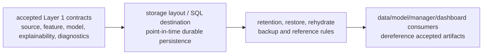

# Layer 01 - Market Regime Storage

This file records the `trading-storage` view of Layer 1 persistence. Semantic construction belongs to `trading-data` and `trading-model`; global naming authority belongs to `trading-manager`.

## Durable artifact names

Accepted Layer 1 physical destinations should preserve these canonical names:

```text
trading_data.source_01_market_regime
trading_data.feature_01_market_regime
trading_model.model_01_market_regime
trading_model.model_01_market_regime_explainability
trading_model.model_01_market_regime_diagnostics
```

## Storage boundary

Storage contracts preserve point-in-time availability, row keys, restore/rehydrate expectations, retention policy, and completion receipts. They do not decide model semantics or promote explainability fields into downstream dependencies.

## Column naming

Generic identity, lineage, timestamp, and receipt columns may remain generic. Layer-owned model columns use canonical compact `1_*` names. SQL DDL should quote numeric-leading identifiers where required instead of inventing `layer01_*` semantic aliases.

## Stage flow



## Layer acceptance

Layer 1 storage changes are acceptable when they:

- preserve canonical Layer 1 artifact names and point-in-time availability;
- define durable layout, reference, retention, restore, and rehydrate expectations before producers depend on them;
- avoid deciding data/model semantics or promoting explainability/diagnostics fields into downstream dependencies;
- avoid committing generated outputs, logs, credentials, or secrets;
- route shared fields, statuses, artifact-reference formats, or storage contract names through `trading-manager/scripts/` before cross-repository dependence.

Current verification:

```bash
git status --short
find docs -maxdepth 1 -type f | sort
find . -maxdepth 2 -type f | sort
git diff --check
```
