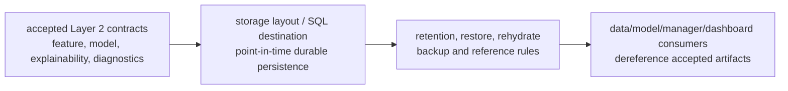

# Layer 02 - Sector Context Storage

This file records the `trading-storage` view of Layer 2 persistence. Semantic construction belongs to `trading-data` and `trading-model`; global naming authority belongs to `trading-manager`.

## Durable artifact names

Accepted Layer 2 physical destinations should preserve these canonical names:

```text
trading_data.feature_02_sector_context
trading_model.model_02_sector_context
trading_model.model_02_sector_context_explainability
trading_model.model_02_sector_context_diagnostics
```

There is no accepted `source_02_sector_context` storage artifact. `source_02_target_candidate_holdings` is downstream candidate-builder / Layer 3 input-preparation evidence, not Layer 2 core behavior input.

## Storage boundary

Storage contracts preserve point-in-time availability, row keys, restore/rehydrate expectations, retention policy, and completion receipts. They do not decide model semantics or promote explainability or diagnostics fields into downstream dependencies.

## Column naming

Generic identity, lineage, timestamp, and receipt columns may remain generic. Layer-owned model columns use canonical compact `2_*` names. SQL DDL should quote numeric-leading identifiers where required instead of inventing `layer02_*` semantic aliases.

## Stage flow



## Layer acceptance

Layer 2 storage changes are acceptable when they:

- preserve canonical Layer 2 artifact names and point-in-time availability;
- avoid adding `source_02_sector_context` storage unless a later accepted contract creates it;
- keep `source_02_target_candidate_holdings` downstream of Layer 2 core behavior modeling;
- define durable layout, reference, retention, restore, and rehydrate expectations before producers depend on them;
- route shared fields, statuses, artifact-reference formats, or storage contract names through `trading-manager/scripts/` before cross-repository dependence.

Current verification:

```bash
git status --short
find docs -maxdepth 1 -type f | sort
find . -maxdepth 2 -type f | sort
git diff --check
```
