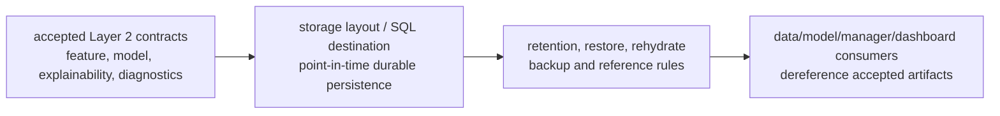

# Layer 02 - Sector Context Storage

This file records the `trading-storage` view of Layer 2 persistence. Semantic construction belongs to `trading-data` and `trading-model`; global naming authority belongs to `trading-manager`.

## Durable artifact names

Accepted Layer 2 physical destinations should preserve these canonical names:

```text
trading_data.m02_sector_context_feature_generation
trading_model.m02_sector_context_model_generation
trading_model.m02_sector_context_model_generation_explainability
trading_model.m02_sector_context_model_generation_diagnostics
```

There is no separate Layer 2 source storage artifact. The conceptual Layer 2 model output is per-ETF `context_etf_state`; the current physical table is `trading_model.m02_sector_context_model_generation` with the `sector_context_state` vocabulary.

Layer 2 sector context is restricted to the 11 broad Select Sector SPDR anchor ETFs in `main/shared/layer_01_02_market_context_etf_universe.csv`. Focused industry-chain, theme, and special-beta ETFs such as semiconductor, cybersecurity, ARK, biotech, retail, and blockchain funds are not Layer 2 sector anchors. They are outside the current Layer 2 contract unless a later reviewed proxy/theme layer is introduced.

ETF holdings are not the candidate universe. Ordinary equity candidates come from the reviewed total-symbol pool and target metadata, while Layer 2 supplies the broad sector anchor state attached to those candidates.

## Storage boundary

Storage contracts preserve point-in-time availability, row keys, restore/rehydrate expectations, retention policy, and completion receipts. They do not decide model semantics or promote explainability or diagnostics fields into downstream dependencies.

Layer 2 storage should distinguish:

- per-sector-anchor `context_etf_state` rows, currently stored through `m02_sector_context_model_generation`;
- optional global/group `cross_etf_summary` rows or artifacts;
- internal per-ETF cross-section calculations, which should not become separate durable output rows when embedded in `context_etf_state`;
- target routing evidence for Layer 1 ETF targets, Layer 2 context ETF targets, and ordinary targets.

## Column naming

Generic identity, lineage, timestamp, and receipt columns may remain generic. Layer-owned model columns use canonical compact `2_*` names. SQL DDL should quote numeric-leading identifiers where required instead of inventing `layer02_*` semantic aliases. The active `m02_sector_context_model_generation` column set uses signed direction, direction-neutral trend/tradability, transition risk, separate handoff state/bias, coverage, data-quality, and evidence-count fields; readiness aliases such as `2_selection_readiness_score` are not durable storage contract columns.

## Stage flow



## Layer acceptance

Layer 2 storage changes are acceptable when they:

- preserve canonical Layer 2 artifact names and point-in-time availability;
- avoid adding a separate Layer 2 source artifact unless a later accepted contract creates it;
- keep Layer 2 sector context restricted to broad sector anchors, not focused industry/theme ETFs;
- keep ETF holdings out of ordinary equity candidate-universe definition;
- avoid durable `context_etf_cross_section_row` output rows when their values are construction evidence already embedded in `context_etf_state`;
- preserve the three target-context routing cases before introducing new storage tables for `target_context_profile`;
- define durable layout, reference, retention, restore, and rehydrate expectations before producers depend on them;
- route shared fields, statuses, artifact-reference formats, or storage contract names through `trading-manager/scripts/` before cross-repository dependence.

Current verification:

```bash
git status --short
find docs -maxdepth 1 -type f | sort
find . -maxdepth 2 -type f | sort
git diff --check
```
